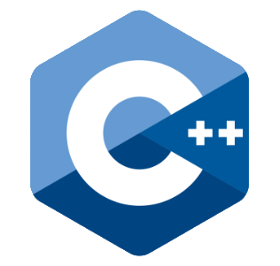
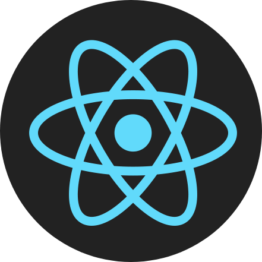
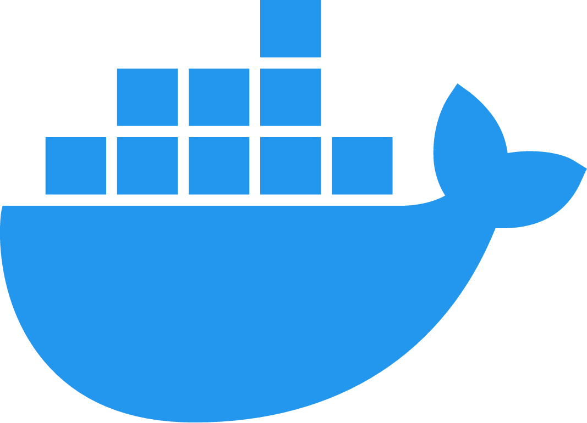
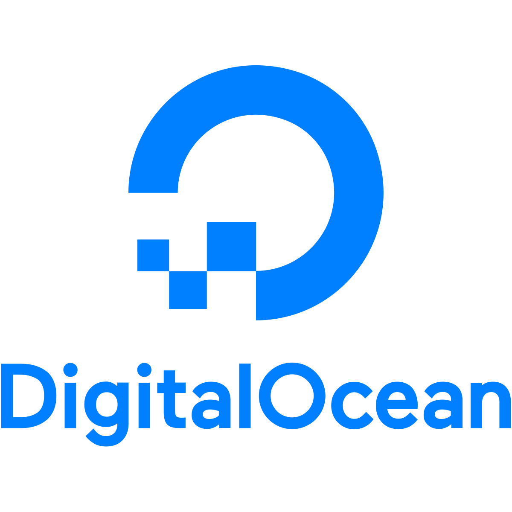
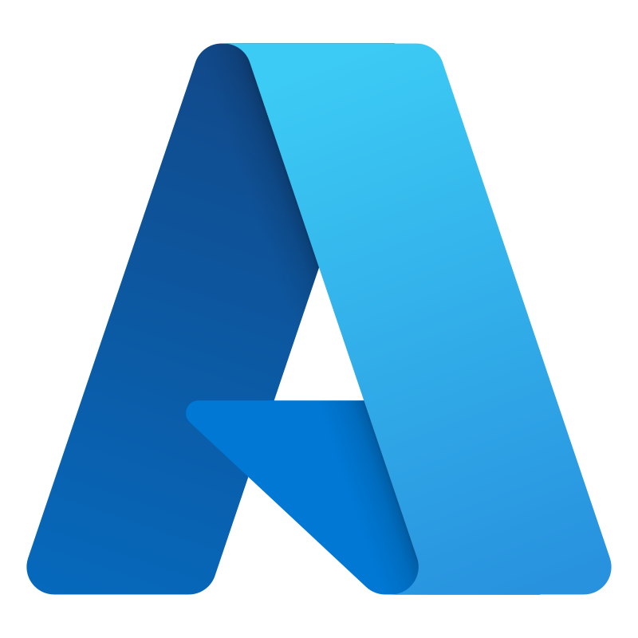

# Hi! I'm Hargun👋

### I study Software Engineering at the University of Waterloo. 📚

 

## Technologies/Languages 📑

 

## Github statistics 💻

 

## Recent Personal projects ⚡

-   ### [Python Trading Bot](https://github.com/hargunmujral/python-trading-bot)
-   ### [SafeSurrey](https://github.com/hargunmujral/SafeSurrey)
-   ### [Neural Network Project](https://github.com/hargunmujral/Neural-Network-Project)
-   ### [Heart Health Prediction](https://github.com/hargunmujral/Heart-Failure-Prediction)

 

## Hackathons 🏆

-   ### *Best use of DigitalOcean* - FreyHacks 2022: "[SumFun](https://devpost.com/software/sumfun)"
-   ### *Participant* - Hack The North 2021: "[Tax Auto](https://devpost.com/software/tax-auto)"
-   ### *Most Creative Hack* - Waterloo SE26 Mini Hackathon: "[Goose Genocide](https://devpost.com/software/goose-genocide)"

 

## Beyond Projects ✌️

-   ### Math nerd ➗
-   ### EDM Fanatic 🎶
-   ### Avid investor and finance guy 📈
-   ### Professional weeb 😨
-   ### C++ competitive programmer ✅

 

## Socials 📫

-   ### [LinkedIn](https://www.linkedin.com/in/hargun-mujral/)
-   ### [Devpost](https://devpost.com/hargunmujral)
-   ### [Instagram](https://www.instagram.com/hargun.mu/)
