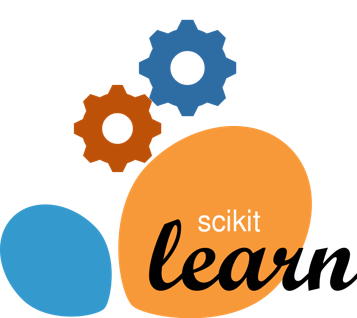

# Hi! I'm Hargun👋

### I study Software Engineering at the University of Waterloo. 📚

### I'm passionate about applying the intersection of Machine Learning and Software Engineering to create societal impact 🤖

 

## Technologies/Languages 📑

 

 

## Recent Open-Source Personal projects ⚡

- [SSH Docker Pipeline](https://github.com/zrwaite/SSHDockerPipeline)
- [X-Ray Tooling](https://github.com/WAT-ai/X-Ray-Tooling)
- [Simplex Calculator](https://github.com/hargunmujral/Simplex-Calculator)
- [Prostate Cancer Prediction](https://github.com/WAT-ai/medical-image-processing)

Note: Some of my projects are closed-source due to data sensitivity and contract involvement. If you would like more information, feel free to schedule a meeting with me.

 

## Hackathons 🏆

- _Best use of DigitalOcean_ - FreyHacks 2022: "[SumFun](https://devpost.com/software/sumfun)"
- _Participant_ - Hack The North 2021: "[Tax Auto](https://devpost.com/software/tax-auto)"
- _Most Creative Hack_ - Waterloo SE26 Mini Hackathon: "[Goose Genocide](https://devpost.com/software/goose-genocide)"

 

## Other Interests ✌️

- Math nerd ➗
- EDM Fanatic 🎶
- Machine Learning Researcher 📈
- Competitive programmer ✅

 

## Socials 📫

- [LinkedIn](https://www.linkedin.com/in/hargun-mujral/)
- [Devpost](https://devpost.com/hargunmujral)
- [Instagram](https://www.instagram.com/hargun.mu/)
